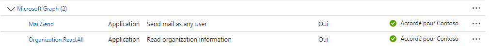
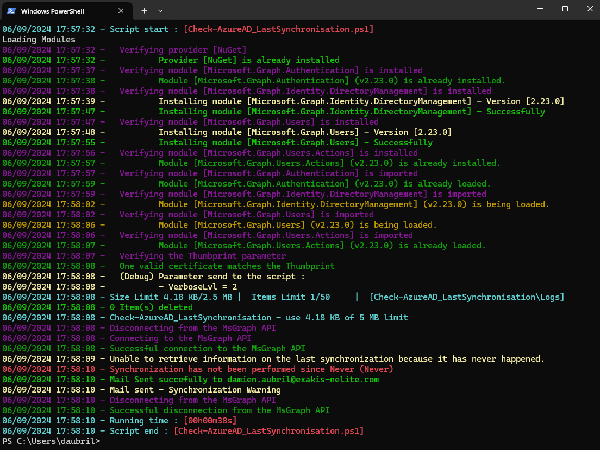

# The *Check-AADLastSynchronisation.ps1* PowerShell Script

This script checks the Azure Active Directory (Azure AD) synchronization status by comparing the last sync time with a specified threshold. 
If the sync is found to be out of date, an alert email is sent. The script also logs relevant information and errors to specific log files. 
It uses Microsoft Graph API and handles module loading, certificate validation, and email notifications in case of errors.

# Syntax
```powershell
.\Check-AADLastSynchronisation.ps1 [[-VerboseLvl] <Byte>] [-AllowBeta] [<CommonParameters>]
```

This script supports the common parameters: Verbose, Debug, ErrorAction, ErrorVariable, WarningAction, 
WarningVariable, OutBuffer, PipelineVariable, and OutVariable.

# Parameters
```powershell
-VerboseLvl <Byte>
     Specifies the level of verbosity for logging. Logs are always written to a file, but console output varies:
    - `0`: No console output (silent mode). All output is logged to the file.
    - `1`: Minimal logging. Root level information and errors are displayed.
    - `2`: Basic logging. Displays basic information and errors. (DEFAULT)
    - `3`: Standard logging. Displays standard log messages, basic information, and errors.
    - `4`: Verbose logging. Displays detailed log messages, standard information, and errors.
    - `5`: Ultra verbose logging. Displays debug information, detailed log messages, standard information, and errors.
    
    Obligatoire :                         false
    Position :                            1
    Valeur par défaut                     2
    Accepter l entrée de pipeline :       false
    Accepter les caractères génériques :  false
```
```powershell
-AllowBeta [<SwitchParameter>]
     If set to $true, the script will allow the installation of beta versions of Microsoft Graph modules. By default, it is set to $false.
    
    Obligatoire :                         false
    Position :                            named
    Valeur par défaut                     False
    Accepter l entrée de pipeline :       false
    Accepter les caractères génériques :  false
```


# Related Links
- https://github.com/Webi-Time/WBScripts/blob/main/PowerShell/Documentation/Check-AADLastSynchronisation/ReadMe.md

- https://github.com/Webi-Time/WBScripts/blob/main/PowerShell/Scripts/Check-AADLastSynchronisation/Check-AADLastSynchronisation.ps1
# Prerequisite
- ## Microsoft Graph API Permissions
	- The *Check-AADLastSynchronisation.ps1* script requires an App Registration in Azure AD with specific permissions to interact with the Microsoft Graph API. The necessary permissions are as follows:

<p align='center'>

</p>

- ## Modules
	- Ensure the **ModuleGenerics** module is installed. More information [How to install **ModuleGenerics**](/Powershell/README.md)

	- The script use function for download and upgrade Microsoft Graph Modules, but you can fixe the module version with **$GraphModulesVrs** variable
<p align='center'>

</p>

- ## Parameters
	- JSON File with tenant information
	- MaxMinutes : This parameter is set to "45" and indicates the maximum number of minutes without synchronization and e-mail alert.

This JSON file contains configurations for a script. It is structured into three sections: Generic, Tenant and Script. Find more explanation [here](/Powershell/README.md)

# Example

1. Example
```powershell
PS> .\Check-AADLastSynchronisation.ps1
```

2. Example
```powershell
PS> .\Check-AADLastSynchronisation.ps1 -VerboseLvl 0
```
# Execution


