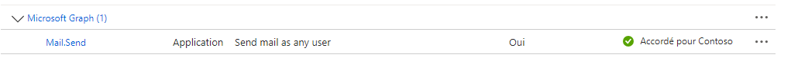
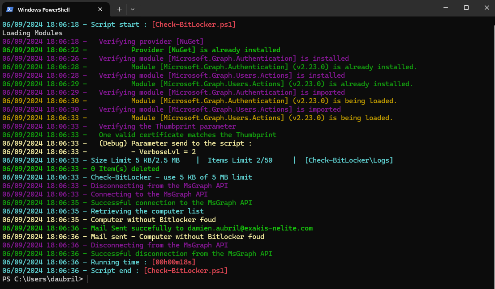

# The *Check-BitLocker.ps1* PowerShell Script

This script queries Active Directory for computer objects, checks their BitLocker recovery keys, and sends an email 
alert if any computers are missing recovery keys. It uses the Microsoft Graph API to send email notifications.

# Syntax
```powershell
.\Check-BitLocker.ps1 [[-VerboseLvl] <Byte>] [-AllowBeta] [<CommonParameters>]
```

This script supports the common parameters: Verbose, Debug, ErrorAction, ErrorVariable, WarningAction, 
WarningVariable, OutBuffer, PipelineVariable, and OutVariable.

# Parameters
```powershell
-VerboseLvl <Byte>
     Defines the level of verbosity in the script s output.
        - 0: No output to console.
        - 1: Displays errors only.
        - 2: Displays basic information and errors.
        - 3: Displays standard messages, basic information, and errors.
        - 4: Displays detailed messages, standard information, and errors.
        - 5: Displays debug information, detailed messages, standard information, and errors.
    
    Obligatoire :                         false
    Position :                            1
    Valeur par défaut                     2
    Accepter l entrée de pipeline :       false
    Accepter les caractères génériques :  false
```
```powershell
-AllowBeta [<SwitchParameter>]
     If set to $true, the script will allow the installation of beta versions of Microsoft Graph modules. By default, it is set to $false.
    
    Obligatoire :                         false
    Position :                            named
    Valeur par défaut                     False
    Accepter l entrée de pipeline :       false
    Accepter les caractères génériques :  false
```


# Related Links
- https://github.com/Webi-Time/WBScripts/blob/main/PowerShell/Documentation/Check-BitLocker/ReadMe.md

- https://github.com/Webi-Time/WBScripts/blob/main/PowerShell/Scripts/Check-BitLocker/Check-BitLocker.ps1
# Prerequisite
- ## Microsoft Graph API Permissions
	- The *Check-BitLocker.ps1* script requires an App Registration in Azure AD with specific permissions to interact with the Microsoft Graph API. The necessary permissions are as follows:

<p align='center'>

</p>

- ## Modules
	- Ensure the **ModuleGenerics** module is installed. More information [How to install **ModuleGenerics**](/Powershell/README.md)

	- The script use function for download and upgrade Microsoft Graph Modules, but you can fixe the module version with **$GraphModulesVrs** variable
<p align='center'>

</p>

- ## Parameters
	- JSON File with tenant information
- MaxMinutes : This parameter is set to "45" and indicates the maximum number of minutes without synchronization and e-mail alert.

This JSON file contains configurations for a script. It is structured into three sections: Generic, Tenant and Script. Find more explanation [here](/Powershell/README.md)

# Example

1. Example
```powershell
PS> .\Check-BitLocker.ps1
```

2. Example
```powershell
PS> .\Check-BitLocker.ps1 -VerboseLvl 2
```
# Execution


