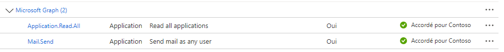
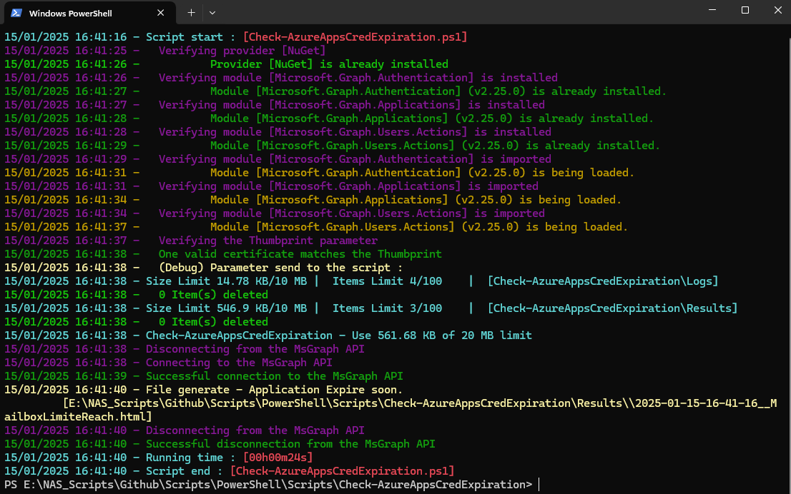

# The *Check-WBAzureAppsCredExpiration.ps1* PowerShell Script

This PowerShell script checks the expiration status of credentials for Azure Applications and sends email alerts if any 
of the credentials are expired or set to expire soon. It leverages the Microsoft Graph API for Azure Application data 
retrieval and email notifications.

# Syntax
```powershell
.\Check-WBAzureAppsCredExpiration.ps1 [[-VerboseLvl] <Byte>] [<CommonParameters>]
```

This script supports the common parameters: Verbose, Debug, ErrorAction, ErrorVariable, WarningAction, 
WarningVariable, OutBuffer, PipelineVariable, and OutVariable.

# Parameters
```powershell
-VerboseLvl <Byte>
     Defines the level of verbosity in the script s output.
        - 0: No output to console.
        - 1: Displays errors only.
        - 2: Displays basic information and errors.
        - 3: Displays standard messages, basic information, and errors.
        - 4: Displays detailed messages, standard information, and errors.
        - 5: Displays debug information, detailed messages, standard information, and errors.
    
    Obligatoire :                         false
    Position :                            1
    Valeur par défaut                     2
    Accepter l entrée de pipeline :       false
    Accepter les caractères génériques :  false
```


# Related Links
- https://github.com/Webi-Time/WBScripts/blob/main/PowerShell/Documentation/Check-WBAzureAppsCredExpiration/ReadMe.md

- https://github.com/Webi-Time/WBScripts/blob/main/PowerShell/Scripts/Check-WBAzureAppsCredExpiration/Check-WBAzureAppsCredExpiration.ps1
# Prerequisite
- ## Microsoft Graph API Permissions
	- The *Check-WBAzureAppsCredExpiration.ps1* script requires an App Registration in Azure AD with specific permissions to interact with the Microsoft Graph API. The necessary permissions are as follows:

<p align='center'>

</p>

- ## Modules
	- Ensure the **ModuleGenerics** module is installed. More information [How to install **ModuleGenerics**](/PowerShell/ReadMe-Modules-Installation.md)

	- The script uses function for download and upgrade Microsoft Graph Modules, but you can fix the module version with **$GraphModulesVrs** variable
<p align='center'>

</p>

- ## Parameters
	- JSON File with tenant information
- LimitExpirationDays : This parameter is set to "90" and indicates the number of days before expiration for sending an e-mail alert.

This JSON file contains configurations for a script. It is structured into three sections: Generic, Tenant and Script. Find more explanation [here](/PowerShell/ReadMe-JSON-File.md)

# Example

1. Example
```powershell
PS> .\Check-WBAzureAppsCredExpiration.ps1 -VerboseLvl 0
```

2. Example
```powershell
PS> .\Check-WBAzureAppsCredExpiration.ps1 -VerboseLvl 2
```

## Notes
Additional Notes:
Ensure the required PowerShell modules (ModuleGenerics, ActiveDirectory) are installed and accessible.
 
Ensure you have the necessary permissions to access Azure AD data.

Ensure that the App Registration is granted the following permissions:
- Microsoft Graph -> Mail.send
- Microsoft Graph -> Application.Read.All

>Author: Damien Aubril

>License: Not applicable

>Date: October 26, 2023


>Version: 1.0

Change Log :
- Update - 05/09/2024
- Update - 15/01/2025

# Execution


