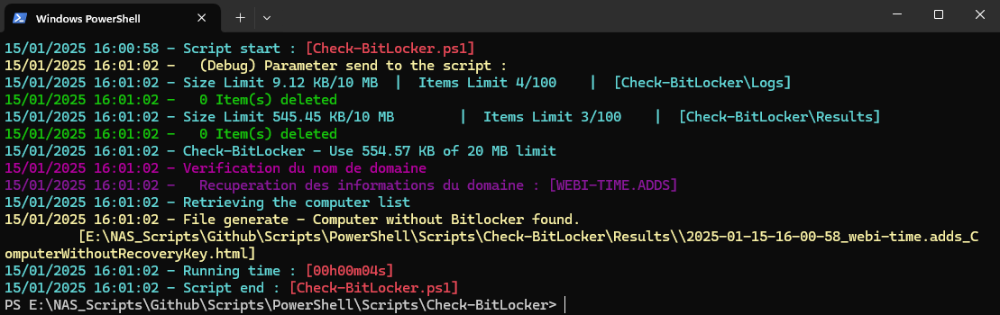

# The *Check-WBBitLocker.ps1* PowerShell Script

This script queries Active Directory for computer objects, checks their BitLocker recovery keys, and sends an email 
alert if any computers are missing recovery keys..

# Syntax
```powershell
.\Check-WBBitLocker.ps1 [[-VerboseLvl] <Byte>] [[-Domain] <String>] [<CommonParameters>]
```

This script supports the common parameters: Verbose, Debug, ErrorAction, ErrorVariable, WarningAction, 
WarningVariable, OutBuffer, PipelineVariable, and OutVariable.

# Parameters
```powershell
-VerboseLvl <Byte>
     Defines the level of verbosity in the script s output.
        - 0: No output to console.
        - 1: Displays errors only.
        - 2: Displays basic information and errors.
        - 3: Displays standard messages, basic information, and errors.
        - 4: Displays detailed messages, standard information, and errors.
        - 5: Displays debug information, detailed messages, standard information, and errors.
    
    Obligatoire :                         false
    Position :                            1
    Valeur par défaut                     2
    Accepter l entrée de pipeline :       false
    Accepter les caractères génériques :  false
```
```powershell
-Domain <String>
     
    Obligatoire :                         false
    Position :                            2
    Valeur par défaut                     
    Accepter l entrée de pipeline :       false
    Accepter les caractères génériques :  false
```


# Related Links
- https://github.com/Webi-Time/WBScripts/blob/main/PowerShell/Documentation/Check-WBBitLocker/ReadMe.md

- https://github.com/Webi-Time/WBScripts/blob/main/PowerShell/Scripts/Check-WBBitLocker/Check-WBBitLocker.ps1
# Prerequisite
- ## Modules
	- Ensure the **ModuleGenerics** module is installed. More information [How to install **ModuleGenerics**](/PowerShell/ReadMe-Modules-Installation.md)


- ## Parameters
	- JSON File with tenant information

This JSON file contains configurations for a script. It is structured into three sections: Generic, Tenant and Script. Find more explanation [here](/PowerShell/ReadMe-JSON-File.md)

# Example

1. Example
```powershell
PS> .\Check-WBBitLocker.ps1
```

2. Example
```powershell
PS> .\Check-WBBitLocker.ps1 -VerboseLvl 2
```

## Notes
Ensure the [ModuleGenerics] module is installed 


>Author: Damien Aubril

>License: Not applicable

>Date: October 26, 2023


>Version: 1.0

Change Log :
- Update - 05/09/2024
- Update - 15/01/2025

# Execution


