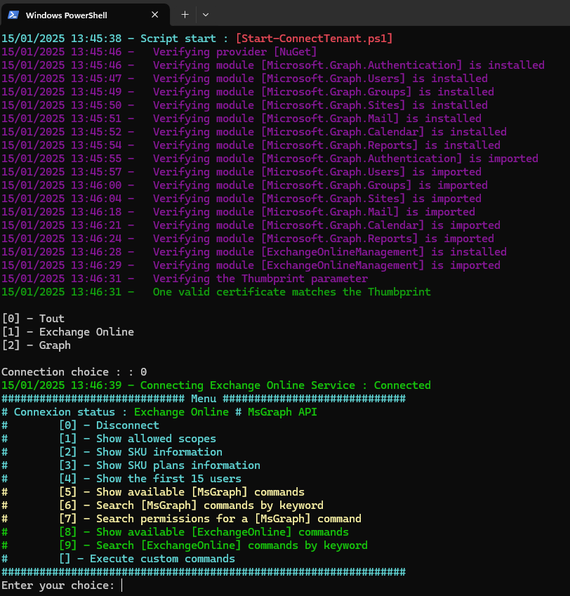

# The *Start-WBConnectTenant.ps1* PowerShell Script

This PowerShell script establishes a connection to a Microsoft Graph API tenant using specified credentials. It then 
provides a menu-driven interface for administrators to interact with the tenant, enabling actions such as displaying 
authorized scopes, SKU information, user details, and more.

# Syntax
```powershell
.\Start-WBConnectTenant.ps1 [[-VerboseLvl] <Byte>] [[-LogOff]] [<CommonParameters>]
```

This script supports the common parameters: Verbose, Debug, ErrorAction, ErrorVariable, WarningAction, 
WarningVariable, OutBuffer, PipelineVariable, and OutVariable.

# Parameters
```powershell
-VerboseLvl <Byte>
     Defines the level of verbosity in the script s output.
        - 0: No output to console.
        - 1: Displays errors only.
        - 2: Displays basic information and errors.
        - 3: Displays standard messages, basic information, and errors.
        - 4: Displays detailed messages, standard information, and errors.
        - 5: Displays debug information, detailed messages, standard information, and errors.
    
    Obligatoire :                         false
    Position :                            1
    Valeur par défaut                     2
    Accepter l entrée de pipeline :       false
    Accepter les caractères génériques :  false
```
```powershell
-LogOff [<SwitchParameter>]
     A switch parameter that, when specified, allows for a graceful disconnection from the Microsoft Graph tenant and others. It ends 
    the session without executing further actions. By default, it is set to $false.
    
    Obligatoire :                         false
    Position :                            2
    Valeur par défaut                     False
    Accepter l entrée de pipeline :       false
    Accepter les caractères génériques :  false
```


# Related Links
- https://github.com/Webi-Time/WBScripts/blob/main/PowerShell/Documentation/Start-WBConnectTenant/ReadMe.md
- https://github.com/Webi-Time/WBScripts/blob/main/PowerShell/Scripts/Start-WBConnectTenant/Start-WBConnectTenant.ps1
# Prerequisite
- ## Microsoft Graph API Permissions
	- The *Start-WBConnectTenant.ps1* script requires an App Registration in Azure AD with specific permissions to interact with the Microsoft Graph API. The necessary permissions are as follows:

<p align='center'>

</p>

- ## Modules
	- Ensure the **ModuleGenerics** module is installed. More information [How to install **ModuleGenerics**](/PowerShell/ReadMe-Modules-Installation.md)

	- The script use function for download and upgrade Microsoft Graph Modules, but you can fix the module version with **$GraphModulesVrs** variable
<p align='center'>

</p>

- ## Parameters
	JSON File

This JSON file contains configurations for a script. It is structured into three sections: Generic, Tenant and Script. Find more explanation [here](/PowerShell/ReadMe-JSON-File.md)

# Example

1. Example
```powershell
PS> .\Start-WBConnectTenant.ps1
```

## Notes
Additional Notes:

Ensure the required PowerShell modules (ModuleGenerics) are installed and accessible.

Ensure that the App Registration is granted the following permissions: 

- Api use by my organisation -> Office 365 Exchange Online -> Application -> Exchange.ManageAsApp
https://learn.microsoft.com/en-us/powershell/exchange/app-only-auth-powershell-v2?view=exchange-ps#select-and-assign-the-api-permissions-from-
the-portal
- Api Microsoft Graph -> Microsoft Graph -> Delegated -> User.Read (at least for the connexion)

For Exchange connection, ensure that you are a member of at least one of the following groups:

- Compliance Administrator
- Exchange Administrator
- Exchange Recipient Administrator
- Global Administrator
- Global Reader
- Helpdesk Administrator
- Security Administrator
- Security Reader	

>Author: Damien Aubril

>License: Not applicable

>Date: October 26, 2023


>Version: 1.0

Change Log :
- Update - 12/12/2024

# Execution


